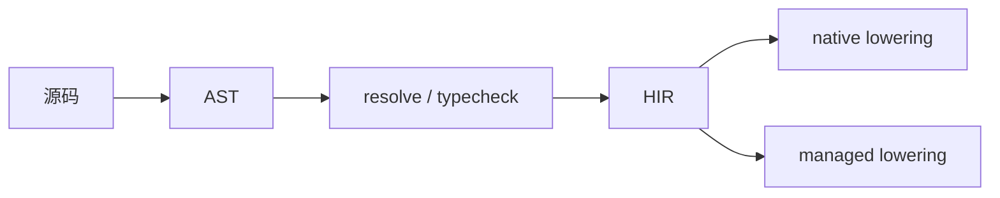

# 目标模式与执行边界

本文档定义 `lona` 的两种目标模式：

- `native`
- `managed`

重点不是介绍某个具体实现细节，而是约束编译模型、模块边界和后端分流位置，避免后续实现时把两条路线重新混成一条。

## 1. 设计原则

### 1.1 目标模式是编译契约

`native` 和 `managed` 是两种不同的编译目标，不是一个通用产物上附带的两个开关。

因此：

- 一次编译只选择一种模式
- 模式是 `Session / Workspace / ModuleInterface / Artifact` 的组成部分
- 同一模块在同一轮编译中只能处于一种模式下

### 1.2 前端统一，后端分流

两种模式共享前端分析链：

- 词法分析
- 语法分析
- 名称解析
- 类型检查
- HIR 构建

分流位置在 `HIR` 之后。

### 1.3 HIR 保持目标中立

`HIR` 的职责是承载语义层中间表示，不提前绑定：

- LLVM ABI 细节
- 托管运行时对象布局
- 原生启动约定
- GC 元数据实现方式

这些内容应放在 `HIR -> target lowering` 之后。

## 2. 两种模式的定位

### 2.1 `native`

`native` 面向：

- 原生可执行文件
- bare / system 两类原生链路
- 最小运行时
- 裸机或偏底层场景

主要特点：

- 追求更高性能上限
- 运行时依赖更少
- 更接近传统系统语言工作方式

限制：

- 不默认具备 GC
- 不默认具备反射
- 不默认具备托管运行时 backtrace 能力
- 不应直接依赖托管运行时 API

### 2.2 `managed`

`managed` 面向：

- LLVM IR 托管运行时
- 运行时元数据驱动的执行环境
- 更丰富的语言服务和诊断能力

目标能力包括：

- GC
- 反射
- 完整 backtrace
- 更强的运行时诊断
- 更接近 Java / C# 的工程体验

要求：

- 依赖托管运行时契约
- 依赖运行时入口、元数据和对象模型
- 允许调用托管运行时提供的 API

## 3. 模块边界

### 3.1 模块模式必须显式一致

模块系统中，目标模式必须随模块一起传播。

也就是说：

- `native` 模块默认只能导入 `native` 模块
- `managed` 模块默认只能导入 `managed` 模块

如果将来需要跨模式调用，应通过显式边界实现，而不是默认互通。推荐方式是：

- FFI
- runtime bridge
- 明确的 ABI adapter

### 3.2 模块接口需要携带模式信息

`ModuleInterface` 至少应包含：

- 模块标识
- 目标模式
- 类型定义
- 函数签名
- 导入依赖
- 接口摘要哈希

这样 import 分析、缓存复用和增量失效判断才能保持一致。

## 4. 能力边界

### 4.1 标准库分层

建议把标准库或内建能力划成三层：

- `core`
  - 两种模式都可使用
- `managed`
  - 只暴露给托管目标
- `native`
  - 只暴露给原生目标

例如：

- `core`
  - 基础类型、集合、常规语义工具
- `managed`
  - 反射、GC 交互、托管 backtrace、运行时类型信息
- `native`
  - 裸机入口、系统调用封装、低级内存控制、原生启动环境

### 4.2 语义检查阶段就做能力校验

目标模式限制不应留到最终链接阶段才报错。

更合理的做法是：

- resolve / typecheck 阶段就识别能力来源
- 如果 `native` 代码调用了 `managed` API，直接报错
- 如果 `managed` 代码依赖了只允许原生目标的能力，也直接报错

这类检查本质上是 capability check。

## 5. 后端分流

### 5.1 `native lowering`

`native lowering` 负责把 HIR 映射到：

- 原生函数约定
- 原生调用边界
- 原生模块 artifact
- system / bare 最终可执行链路

当前仓库已经有这条路线的基础实现：

- `lona-ir`
- `lac`
- `lac-native`

### 5.2 `managed lowering`

`managed lowering` 需要补齐以下契约：

- 托管对象模型
- 运行时入口约定
- 反射元数据
- GC 安全点与栈地图
- runtime API 调用面
- backtrace / 诊断数据

因此，`managed` 不是“把当前 native IR 直接交给另一个执行器”这么简单，而是独立 target 的实现工程。

## 6. 当前工程建议

为了让后续实现不走回头路，建议把以下字段正式加入编译模型：

- `TargetMode`
- `CapabilitySet`
- `ModuleInterface.targetMode`
- `ModuleArtifact.targetMode`

同时补齐这些检查：

1. CLI 或编译入口显式选择模式
2. `WorkspaceLoader` 在 import 时校验依赖模式
3. `ModuleInterface` 缓存带上模式信息
4. `resolve / typecheck` 做 capability check
5. `WorkspaceBuilder` 按模式选择 lowering 路径

## 7. 当前状态

当前仓库已经具备：

- `native` 路线的基础编译与执行链路
- 统一前端与 HIR
- 模块化编译与增量缓存基础结构

当前还没有完成：

- `managed` 运行时契约
- `managed lowering`
- 目标模式级模块隔离检查
- capability-based 语义限制

## 8. 结论

`lona` 的两条路线应当理解为：

- 同一语言前端
- 同一语义分析链
- 同一 HIR 中转层
- 两个不同的目标模式

这样既能保留语言统一性，也能让 `managed` 和 `native` 各自朝着清晰的工程目标演进。
