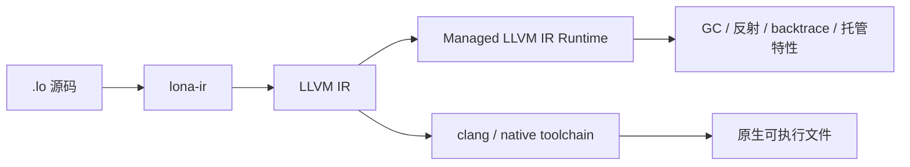
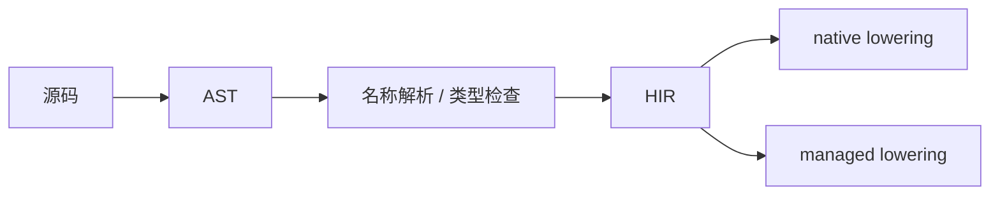

# ✨ lona / 洛语言

`lona`，中文名可以叫 **洛语言**。

它想做的事情很直接：
为系统编程世界提供一种更清爽、更现代、也更容易继续演化的语言设计。

## 🌱 设计哲学

> **简约 · 易用 · 实用**

这不是一句装饰性的口号，而是 `lona` 的核心约束：

- **简约**：语法和概念尽量收敛，不把复杂性随意推给使用者
- **易用**：编译流程、模块组织、错误提示、工具链入口都应当尽量直观
- **实用**：优先解决真实工程问题，而不是为了“语言炫技”堆功能

## 🧭 现在的 lona 是什么

`lona` 目前仍处于设计早期。

它今天更接近一个 **简单、可工作的 C 风格语言**。
能力范围还不大，很多高级特性也还没有完成。

不过，`lona` 的目标并不是在功能数量上与发展了几十年的 C/C++ 比拼。
它关心的是另一件事：

**用更好的语言设计、编译结构和运行方式，提供一条比传统 C/C++ 更舒展的路线。**

## 🚀 lona 想去哪里

`lona` 的长期方向不是单一路径，而是两种执行模式并存：

### 🧠 Managed LLVM IR

源码先编译成 LLVM IR，再交给一个“LLVM IR 托管运行时”执行。

这个方向和比较早期的 `VMKit + MMTk` 一类思路有相似气质：
底层保持 LLVM IR 的性能基础，运行层争取托管语言的能力边界。

目标能力包括：

- GC
- 反射
- 完整 backtrace
- 更强的运行时诊断
- 更接近 Java / C# 的工程体验

### ⚙️ Native IR Execution

LLVM IR 直接继续编译为原生可执行文件。

这个方向保留系统编程最重要的能力：

- 更高的性能上限
- 更直接的部署方式
- 更适合裸机、最小运行时、底层开发

同时也接受一个事实：
原生模式通常不会天然拥有托管运行时的全部特性。

## 🔀 双路线示意



## 🧩 模式边界

`managed` 和 `native` 是两种 **不同的编译目标**，不是同一份产物顺手附带的两个开关。

这意味着：

- 一次编译只会选择一种模式
- `managed` 模式可以使用托管运行时能力
- `native` 模式面向原生执行、最小运行时和更直接的系统环境
- 依赖托管运行时的能力，不应默认出现在 `native` 目标里

工程结构上，这两条路线会共用前端分析流程，并以 `HIR` 作为中转层：



这套设计的重点在于：

- 语言前端保持统一
- 模块分析流程保持统一
- 目标能力在 `HIR` 之后分流
- 需要托管运行时参与的特性，只在 `managed` 路径下开放

当前仓库已经有 `native` 方向的基础执行链路；`managed` 方向仍然属于长期目标。

## 🛠️ 当前仓库已经完成的事情

目前仓库里的工具入口已经做了拆分：

- `lona-ir`
  - 专注做一件事：把 `.lo` 编译成目标相关的文本 LLVM IR、object bundle，或显式 LTO 的最终 object
- `lac`
  - `lona compiler`
  - 默认走 `x86_64-unknown-linux-gnu`
  - 默认先调用 `lona-ir --emit objects --target x86_64-unknown-linux-gnu`，再调用系统 linker driver 生成可执行文件
- `lac-native`
  - 走 bare 路线
  - 默认走 `x86_64-none-elf`
  - 适合实验原生启动汇编和最小链接环境

这意味着 `lona` 的工具链已经不再只是“产出一份 IR”，而是开始具备更完整的编译入口形态。

补充一点当前约定：

- 文本 LLVM IR 只在显式 `--emit ir` 时生成
- 默认构建和增量复用围绕模块 bitcode / object artifact 展开

## 📦 快速开始

### 依赖

on debain/ubuntu

```bash
apt install llvm-18-dev bison flex clang nlohmann-json3-dev python3-pytest bear
```

### 构建

```bash
make -j4 all
```

### 测试

```bash
make test
```

### 安装

```bash
make install
```

说明：

- `make install` 只安装 `lona-ir`、`lac`、`lac-native`
- bare runtime 资产不安装进系统目录
- system 路径直接复用系统 CRT
- bare 路径如果使用安装后的 `lac-native`，需要用户自己提供 `STARTUP_SRC` 和 `LINKER_SCRIPT`，或者直接在仓库 checkout 里运行 `scripts/lac-native.sh`

### 常用命令

```bash
lona-ir --emit ir --target x86_64-none-elf input.lo output.ll
lona-ir --emit objects --target x86_64-unknown-linux-gnu input.lo output.manifest
lona-ir --emit obj --lto full --target x86_64-unknown-linux-gnu input.lo output.o
lac input.lo output/program
lac-native input.lo output/program
```

### AI Skill 生成

仓库提供了一个 skill 生成器，用来把当前语言语法 / 语义文档整理成一份适合 Codex 使用的 skill：

```bash
python3 scripts/build_lona_skill.py
```

agent安装提示词：

```
将build/skills下的lona-author skill安装到本地
```


## 📚 更多文档

- [文档目录](docs/README.md)
- [编译器架构](docs/internals/compiler/compiler_architecture.md)
- [目标模式与执行边界](docs/internals/runtime/target_modes.md)
- [本地构建与运行](docs/reference/runtime/native_build.md)

## 📄 License

除特别说明外，本仓库中的 `lona` 自有代码根据以下条款分发：

- Apache License 2.0
- MIT License

对应完整文本见：

- [LICENSE-APACHE](LICENSE-APACHE)
- [LICENSE-MIT](LICENSE-MIT)

仓库中包含的第三方代码仍然保留其原始授权条款。当前已知第三方组件和对应说明见：

- [THIRD_PARTY_NOTICES.md](THIRD_PARTY_NOTICES.md)

## 🙌 致谢

感谢所有提出先进特性、实现建议和工程思路的开发者。
`lona` 的很多方向判断，正是在这些讨论中逐步清晰起来的。
